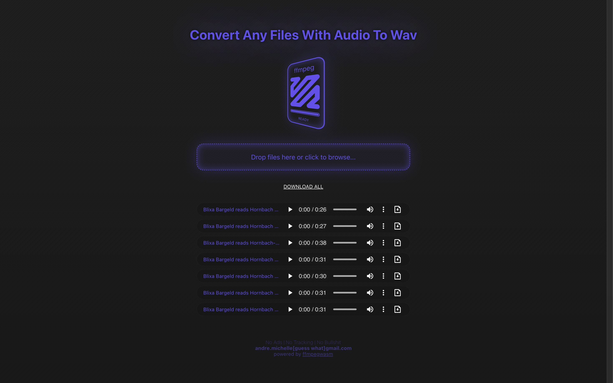

# FFM Audio2Wav

A simple React project to convert any media files to wav if audio is available.
Most heavy lifting is been done by [ffmpeg.wasm](https://github.com/ffmpegwasm/).

[Open FFM](https://www.andremichelle.io/ffm/)

Tested on Macbook Chrome, Safari, Firefox and Safari IOS

This app is registered as a [PWA](https://web.dev/explore/progressive-web-apps), hence being capable of running offline.
